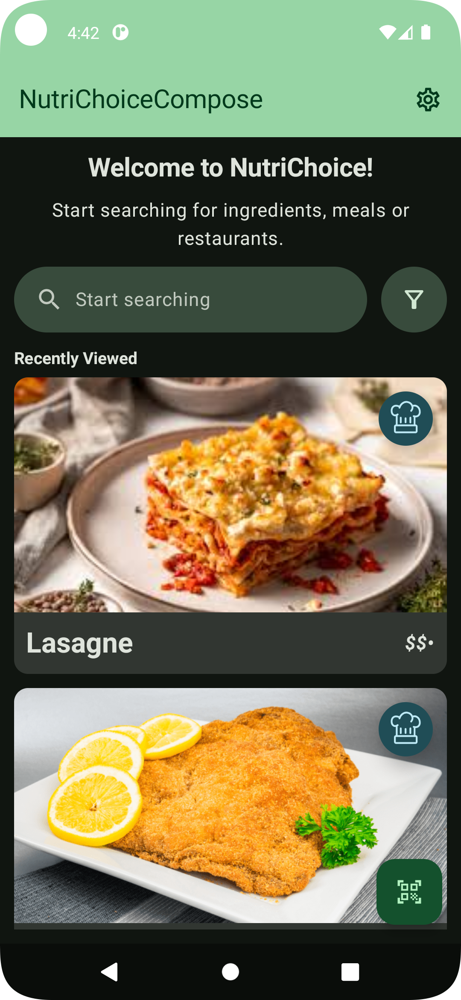
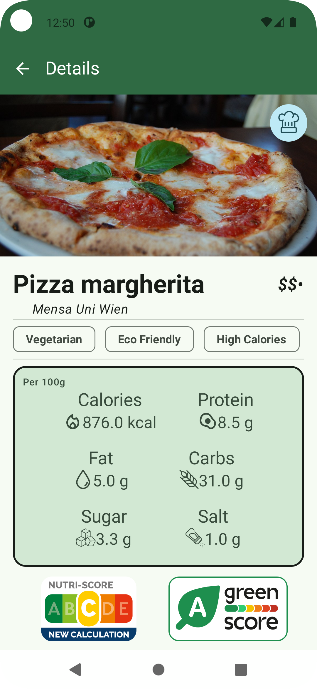

# NutriChoiceCompose

This is a rewrite with Jetpack Compose + Kotlin of *NutriChoice*, an Android application that was originaly written with Views + Java for the *Human-Computer-Interaction* course at the *University of Vienna* in 2025.

Minimum SDK version: 30

## Screenshots
**Dark Mode:**
<table>
    <tr>
        <th></th>
        <th></th>
        <th></th>
    </tr>
    <tr>
        <th></th>
        <th></th>
    </tr>
</table>

**Ligh Mode:**
<table>
    <tr>
        <th></th>
        <th></th>
        <th></th>
    </tr>
    <tr>
        <th></th>
        <th></th>
    </tr>
</table>